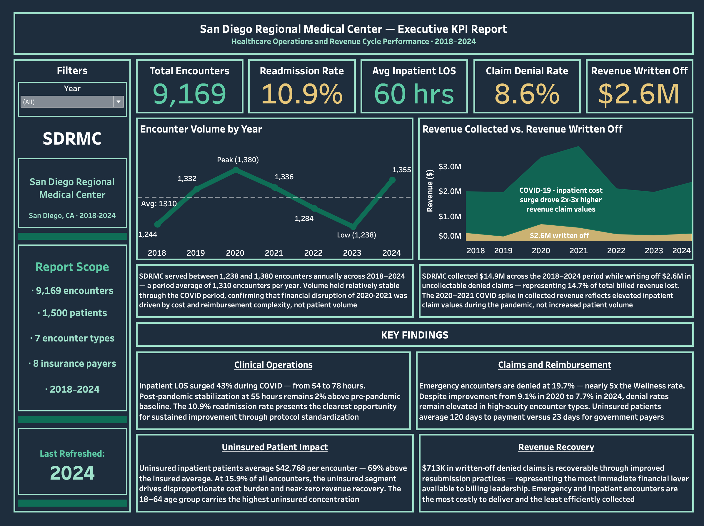
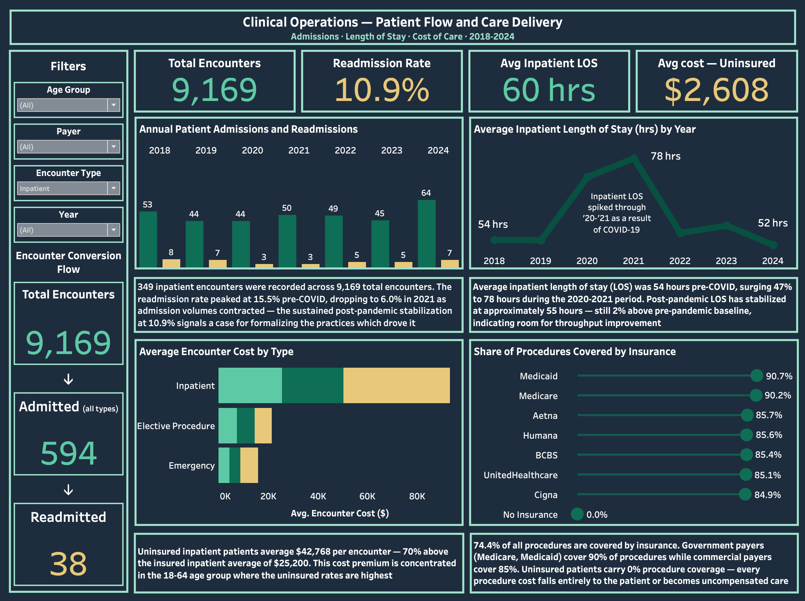
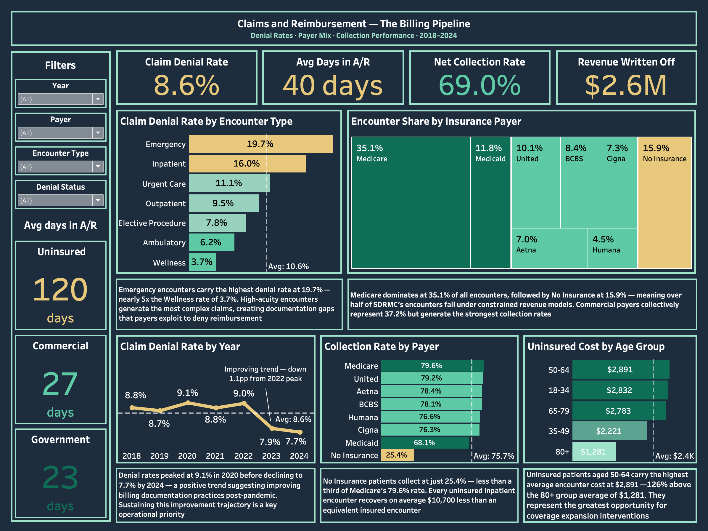
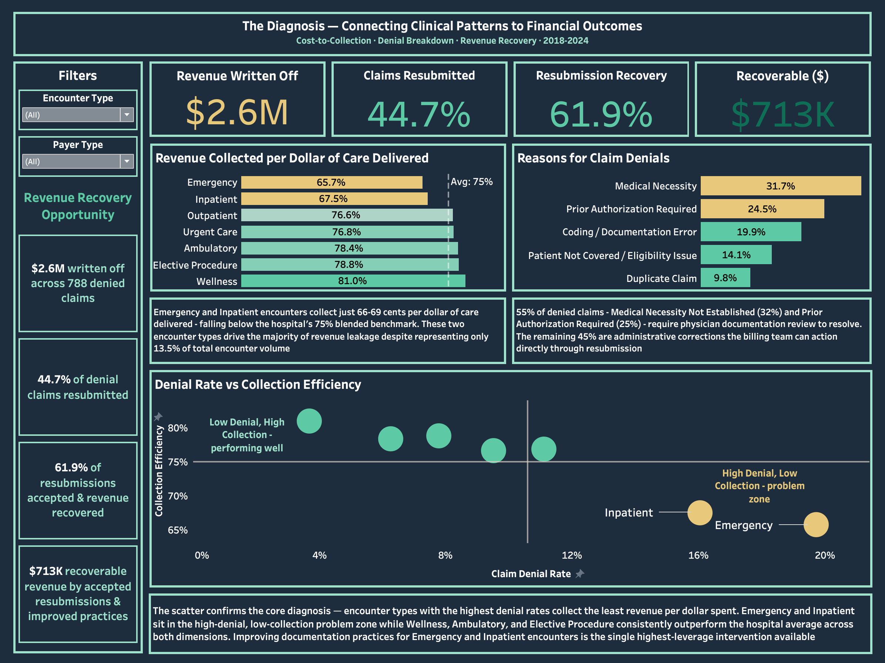

<h1 align="center">San Diego Regional Medical Center — KPI Report</h1>

---

<h1 align="center">Client Background</h1>

As an Analytics Consultant for San Diego Regional Medical Center (SDRMC), I was tasked with developing a high-level KPI report for the executive leadership team, specifically the Chief Financial Officer and Chief Operating Officer. This report comprehensively analyzes **36,330 records** across four interrelated tables — **1,500 patients** (`Patients`), **9,169 clinical encounters** (`Encounters`), **16,492 procedures** (`Procedures`), and **9,169 claims** (`Claims`) — covering 2018 to 2024 across seven encounter types and eight payer categories.

The goal was to move beyond a standard operational snapshot and build a complete revenue cycle narrative — tracing performance from the moment a patient arrives to the moment the hospital collects, or fails to collect, payment for care delivered. Unlike a standard clinical operations report, this analysis extends into the revenue cycle — examining how clinical patterns translate into financial outcomes through the claims and reimbursement pipeline. The analysis is organized across three acts that mirror how hospital leadership actually thinks about performance:

- **Clinical Operations**: patient admissions, readmissions, length of stay, and cost of care across encounter types and payer segments.
- **Claims and Reimbursement**: claim denial rates, payer mix concentration, days in accounts receivable, and net collection performance.
- **The Revenue Diagnosis**: connecting the clinical patterns from Clinical Operations to the financial outcomes in Claims and Reimbursement, and surfacing revenue recovery opportunities for billing leadership through improved resubmission practices.

---

<h1 align="center">Executive Summary</h1>

SDRMC delivered **9,169 patient encounters** between 2018 and 2024 — but the revenue story underneath it becomes harder to ignore. Of **$22.6M** billed across the period, **$2.6M was written off as uncollectable**, representing **14.7%** of total billed revenue lost. That gap is not random — it is concentrated within specific encounter types, specific payer segments, and a billing pipeline that consistently leaves recoverable revenue behind.

The core finding is this: SDRMC's highest-acuity encounter types — Emergency and Inpatient — are simultaneously the most expensive to deliver and the least efficiently collected. Emergency encounters carry a **19.7%** denial rate, nearly **5x** the Wellness rate of **3.7%**, while collecting just **66 cents** per dollar of care delivered. Inpatient encounters follow the same pattern. These two encounter types represent only **13.5%** of total encounter volume but drive a disproportionate share of the hospital's revenue leakage — and closing that gap through improved documentation and resubmission practices is the clearest financial lever this analysis surfaces.

Clinically, SDRMC maintained stable admission volume averaging **1,310 encounters per year**. Across the full period, **349** were classified as inpatient encounters — a **3.8%** inpatient rate — representing the highest-acuity and highest-cost visit category in the data. The 30-day readmission rate averaged **10.9%** — peaking at **15.5%** pre-COVID before dropping to **6.0%** in 2021 as admission volumes contracted during the pandemic. Average inpatient length of stay surged **43%** during the COVID period, from a **54-hour** pre-pandemic baseline to **78 hours** in 2021, before stabilizing at approximately **55 hours**. The hospital hasn't fully returned to pre-pandemic operational efficiency — at **349 inpatient encounters** per period, reclaiming that **2%** gap returns meaningful bed capacity to an already constrained inpatient pipeline."

The uninsured patient segment runs through every dimension of this report as its most persistent pressure point. At **15.9%** of all encounters, uninsured patients average **$42,768** per inpatient encounter — **69%** above the insured average of **$25,254** — while collecting at just **25.4%** of billed charges compared to **79.6%** for Medicare. Their claims average **120** days to payment, more than **5x** the **23-day** government payer average. The cost burden is concentrated in the **18–64** age group, where uninsured rates are highest and the opportunity for coverage intervention is greatest.

On the revenue cycle, the blended claim denial rate of **8.6%** has improved from a **9.1%** peak in 2020 to **7.7%** by 2024 — a positive trend that has not yet translated into full revenue recovery. Of **$3.3M** in denied claims across the period, **44.7%** were resubmitted and **61.9%** of those resubmissions were ultimately paid — leaving an estimated **$713K** recoverable through more consistent resubmission practices. The pipeline is not broken — it is leaking, and the leak has a precise location.

---

<h1 align="center">Insights Deep Dive</h1>

<h2 align="center">Clinical Operations</h2>

**Inpatient encounters represent the smallest share of volume — but carry the highest clinical and financial weight**
* SDRMC recorded **9,169 total encounters** between 2018 and 2024, averaging **1,310** per year. Of those, **349** were classified as inpatient encounters — a **3.8% inpatient rate** — representing the highest-acuity and highest-cost visit category in the data
* The 30-day readmission rate averaged **10.9%** across the period (**38 readmissions, 349 inpatient encounters**), peaking at **15.5%** in 2018–2019 before dropping to **6.0%** in 2021 as admission volumes contracted during the pandemic
*  Post-pandemic readmission rates have stabilized in the **10–11%** range — above the COVID-era low but below the pre-pandemic peak — signaling an opportunity to sustain the operational discipline demonstrated during 2020–2021. For a COO focused on care quality and patient flow, closing the gap between the current **10.9%** rate and the **6.0%** COVID-era low is the most direct lever available.

**The COVID period exposed the fragility of inpatient efficiency — and full recovery hasn't arrived**
* Average inpatient length of stay held at **54 hours** in 2018–2019 before surging **43%** to **78 hours** at its 2021 peak — driven by the complexity and intensity of COVID-era inpatient care
* By 2022, LOS returned to approximately **56 hours** and has hovered near **55 hours** through 2024 — still **2% above** the pre-pandemic baseline of **54 hours**
* At **349 inpatient encounters** per period, each additional hour of average LOS represents **349 bed-hours of capacity**. For a COO evaluating inpatient efficiency, the **1-hour gap** from the pre-pandemic baseline represents recoverable capacity that the hospital has not yet reclaimed.

**Uninsured patients cost significantly more — and the gap concentrates in the working-age population**
* Uninsured inpatient encounters average **$42,768** per visit — **69% above** the insured inpatient average of **$25,254**. Across all encounter types, uninsured patients average **$2,608** versus **$2,238** for insured patients — a **16.5% cost premium** that compounds across **15.9%** of total encounters
* The cost burden is not evenly distributed by age. Patients aged **50–64** carry the highest average encounter cost at **$2,891**, followed by **18–34** at **$2,832**. The **80+** cohort averages just **$1,281** — reflecting near-universal Medicare coverage in that age group
* **74.4%** of all procedures performed at SDRMC are covered by insurance — measured at the individual procedure level, not the encounter level. Government payers cover **90%** of procedures, commercial payers cover **85%**, and uninsured patients carry **0%** procedure coverage by definition. Every uncovered procedure in this dataset belongs to an uninsured patient — there are no exceptions.

--- 

<h2 align="center">Claims and Reimbursement</h2>

**Denial rates are improving — but the gap between high and low-acuity encounter types reveals where the real problem lives**
* SDRMC's blended claim denial rate — the percentage of submitted claims rejected by payers — averaged **8.6%** across 2018–2024, declining from a peak of **9.1%** in 2020 to **7.7%** by 2024
* That headline figure masks significant variation by encounter type. Emergency encounters are denied at **19.7%** — nearly **5x** the **3.7%** Wellness rate. Inpatient encounters follow at **16.0%**. The five remaining encounter types all fall between **6.2%** and **11.1%**
* The concentration of denials within Emergency and Inpatient encounters is not coincidental — these encounters generate the most complex claims, creating documentation gaps that payers consistently exploit to deny reimbursement. For a CFO tracking revenue cycle performance, these two encounter types are where the denial problem lives

**Concentrated payer mix creates a structural ceiling on revenue performance**
* Medicare accounts for **35.1%** of all encounters — the single largest payer category. No Insurance follows at **15.9%** and Medicaid at **11.8%**. Combined, government payers and uninsured patients represent **62.8%** of all encounters — a majority of SDRMC's volume operating under fixed-rate or zero-recovery revenue models
* Commercial payers collectively represent **37.2%** of encounters, but generate the strongest collection performance — clustering between **76.3%** and **79.2%** on accepted claims versus Medicaid at **68.1%** and No Insurance at **25.4%**
* Every percentage-point shift toward a commercial payer mix represents a disproportionate improvement in collection performance. The current payer concentration is not a billing problem — it is a structural revenue constraint that defines the ceiling of what billing optimization alone can achieve

**The uninsured segment creates a cash flow drag that compounds across every dimension of the revenue cycle**
* Uninsured patients average **120 days** from claim submission to payment — the time between when the hospital submits a bill and when it receives any money — more than **5x** the government payer average of **23 days** and **4.5x** the commercial average of **27 days**. The blended Days in A/R across all payer types is **40 days**
* The net collection rate — the percentage of billed charges actually collected — stands at **75.7%** on accepted claims. No Insurance sits at **25.4%** — less than a third of Medicare's **79.6%** rate. Uninsured inpatient encounters cost **$17,514** more to deliver than equivalent insured encounters — a cost premium that is overwhelmingly unrecovered given the **25.4%** collection rate on uninsured claim
* The net collection rate drops from **75.7%** on accepted claims to **69.0%** when denied and written-off claims are included — a **6.7** percentage point gap that quantifies the direct revenue cost of SDRMC's denial volume

--- 

<h2 align="center">The Revenue Diagnosis</h2>

**The highest-cost encounters collect the fewest cents per dollar delivered**
* When amount collected is measured against cost of care delivered, a clear pattern emerges. Wellness encounters collect **81.0 cents** per dollar of care delivered. Elective Procedure encounters collect **78.8 cents**. Emergency encounters collect **65.7 cents** and Inpatient encounters collect **67.5 cents** — both falling below the hospital's **75%** blended benchmark
* Emergency and Inpatient are the only two encounter types that simultaneously carry above-average denial rates and below-average collection efficiency. Every other encounter type sits above the **75%** benchmark on collection and below the **10.6%** simple average on denials
* The revenue gap is not distributed evenly across the hospital — it is concentrated in two encounter types that represent **13.5%** of total volume but account for a disproportionate share of the **$2.6M** written off across the period

**More than half of all denials require physician involvement to resolve — not just billing corrections**
* Of **788** total denied claims across 2018–2024, the two largest denial categories are Medical Necessity Not Established at **31.7%** (**250 claims**) and Prior Authorization Required at **24.5%** (**193 claims**) — together accounting for **56.2%** of all denials
* Both categories require clinical documentation review and in many cases physician attestation to resolve — they cannot be corrected by the billing team alone. For billing leadership, closing the clinical denial gap requires a coordinated response between physicians and administrators
* The remaining **43.8%** of denials — Coding or Documentation Error at **19.9%** (**157 claims**), Patient Not Covered at **14.1%** (**111 claims**), and Duplicate Claim at **9.8%** (**77 claims**) — are administrative in nature and addressable through resubmission without clinical involvement

**$713K is recoverable — and the path to recovery is already partially in place**
* Of **$3.3M** in total denied claim value, **$2.6M** was written off without a single resubmission attempt. The estimated **$712,537** recoverable portion isn't a projection built on optimistic assumptions — it's calculated directly from SDRMC's own resubmission and recovery track record
* The hospital already demonstrates the capability to recover denied claims when it pursues them — **44.7%** of denied claims were resubmitted and **61.9%** of those resubmissions were ultimately paid. The barrier is not capability, it is consistency
* **55.3%** of denied claims are written off without appeal, with **43.8%** classified as administrative denials — Coding errors, eligibility issues, duplicate claims. The billing team can act directly on these denials without physician involvement.

--- 

<h1 align="center">Recommendations</h1>

**Establish a systematic resubmission protocol to recover the $713K sitting in written-off denied claims**

Of **$2,575,189** in written-off denied claims, an estimated **$712,537** is recoverable by applying SDRMC's own historical resubmission and recovery rates consistently across all denial categories. The hospital already demonstrates a **61.9%** recovery rate on claims it resubmits. Priority should be placed on the **43.8%** of denials classified as administrative — Coding or Documentation Error, Patient Not Covered, and Duplicate Claims — where billing staff can resubmit claims directly without physician involvement. A structured **30-day** resubmission review cycle applied to written-off claims would be the most immediate financial lever available to billing leadership.

**Invest in pre-submission documentation review for Emergency and Inpatient claims**

Emergency encounters carry a **19.7%** denial rate and Inpatient encounters carry **16.0%** — the two highest in the data and both well above the **10.6%** simple average across all encounter types. Of all denied claims, **56.2%** cite Medical Necessity Not Established or Prior Authorization Required as the denial reason — both of which originate in documentation gaps during the encounter itself rather than billing errors after the fact. Reviewing clinical notes before submitting claims to insurers for high-acuity encounter types would directly reduce the volume of clinically-driven denials before they enter the pipeline. A targeted documentation audit focused on Emergency and Inpatient encounters — the only two encounter types collecting below the hospital's **75%** blended benchmark — represents the highest-leverage clinical intervention available.

---

<h1 align="center">Questions for Stakeholders Prior to Project Advancement</h1>

*These are questions I would have raised with stakeholders and project leads before finalizing the analysis — to pressure-test assumptions, clarify data definitions, and ensure the insights reflect operational reality.*

**1 — What interval does SDRMC use to define a readmission — 30, 60, or 90 days?** This analysis uses a **30-day** window consistent with Centers for Medicare and Medicaid Services (CMS) standards. A longer interval would capture additional return visits and materially increase the reported **10.9%** readmission rate

**2 — Are readmissions tracked condition-specific or across all diagnoses?** This analysis flags any inpatient return within **30 days** as a readmission regardless of whether the diagnosis matches the original admission. Condition-specific tracking would produce a lower, differently distributed rate

**3 — How does SDRMC's billing team determine which denied claims to resubmit versus write off?** Understanding the criteria currently used to prioritize resubmission attempts would sharpen the **$712,537** recovery opportunity estimate and identify whether the **55.3%** write-off rate reflects deliberate policy or inconsistent practice

**4 — Does SDRMC conduct pre-submission documentation reviews for Emergency and Inpatient claims before they are sent to payers?** **56.2%** of denials cite Medical Necessity Not Established or Prior Authorization Required — both originating in documentation gaps during the encounter. Knowing whether a review process exists before claims are submitted determines whether the fix is process, staffing, or training

**5 — How are encounters with the same patient on consecutive days recorded — as a single continuous encounter or as separate daily entries?** If the EHR resets encounter records at midnight for extended stays, the **349** inpatient encounter count and **60-hour** average LOS may reflect daily resets rather than individual admissions

---

<h1 align="center">Assumptions and Caveats</h1>

**Readmission definition — 30-day window, any diagnosis**
A readmission was defined as any inpatient encounter where the same patient returned for another inpatient visit within **30 days** of their prior discharge, regardless of whether the return visit was related to the original diagnosis. This is consistent with the most widely used industry standard but may overcount readmissions compared to a definition that only flags returns for the same condition. The **10.9%** readmission rate reported here reflects this broad definition — a condition-specific approach would likely produce a lower figure.

**COVID-era attribution — timing-based inference**
The 2020–2021 spike in inpatient length of stay (**54 hours → 78 hours**) and the corresponding surge in inpatient costs were attributed to the COVID-19 pandemic based on the timing of the changes. The data shows the pattern clearly — but does not confirm the cause. The analysis treats COVID as the most plausible explanation given the timeframe, while acknowledging that other operational or external factors may have contributed.

**Revenue recovery opportunity — directional estimate**
The **$712,537** recoverable revenue figure was calculated by applying SDRMC's own historical resubmission rate (**44.7%**) and recovery rate (**61.9%**) to the **$2,575,189** in written-off denied claims. This assumes that written-off claims are as recoverable as the denied claims SDRMC already chose to resubmit — which may not hold for every denial reason or payer. The figure is best understood as a directional opportunity rather than a guaranteed recovery amount.

**Readmission flag — simplified rule applied uniformly**
The readmission flag in the `Encounters` table was calculated using a straightforward rule — same patient, inpatient encounter, within **30 days** of a prior inpatient encounter. Real-world readmission tracking is more nuanced — planned readmissions, transfers from other facilities, and same-day returns are often excluded or treated differently depending on the health system's internal definition. The **38 readmissions** and **10.9%** rate reported here may differ from what SDRMC would report under their own internal methodology.

**Encounter logging — one record assumed per distinct visit**
This analysis treats each record in the `Encounters` table as one complete patient visit from admission to discharge. Some hospital systems reset encounter records at midnight — meaning a patient admitted Monday and discharged Wednesday could appear as three separate records rather than one. If SDRMC's system works that way, the total encounter count of 9,169 and the average inpatient length of stay of 60 hours would both require reinterpretation. This was flagged as a clarifying question for stakeholders prior to project advancement.

**Days in A/R — defined as days between claim submission and payment**
Days in Accounts Receivable (A/R) measures the average number of days between when a claim is submitted to a payer and when payment is received. A lower number indicates faster payment and stronger cash flow management. The blended average of **40 days** across all payer types masks significant variation — from **23 days** for government payers to **120 days** for uninsured patients.

---

<h1 align="center">Dashboard</h1>

The interactive dashboard for this report is available on [Tableau Public](https://public.tableau.com/app/profile/arohit.talari/viz/SanDiegoRegionalMedicalCenter-ExecutiveKPIReport/KPIReport)
